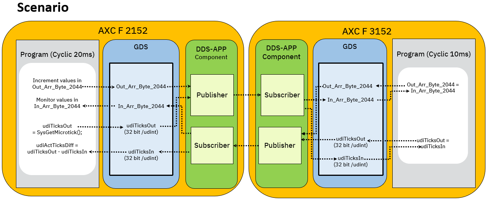
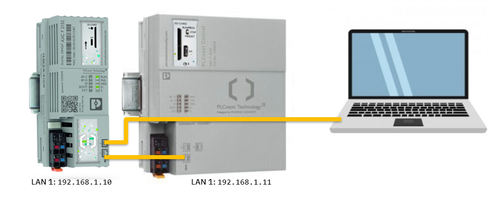
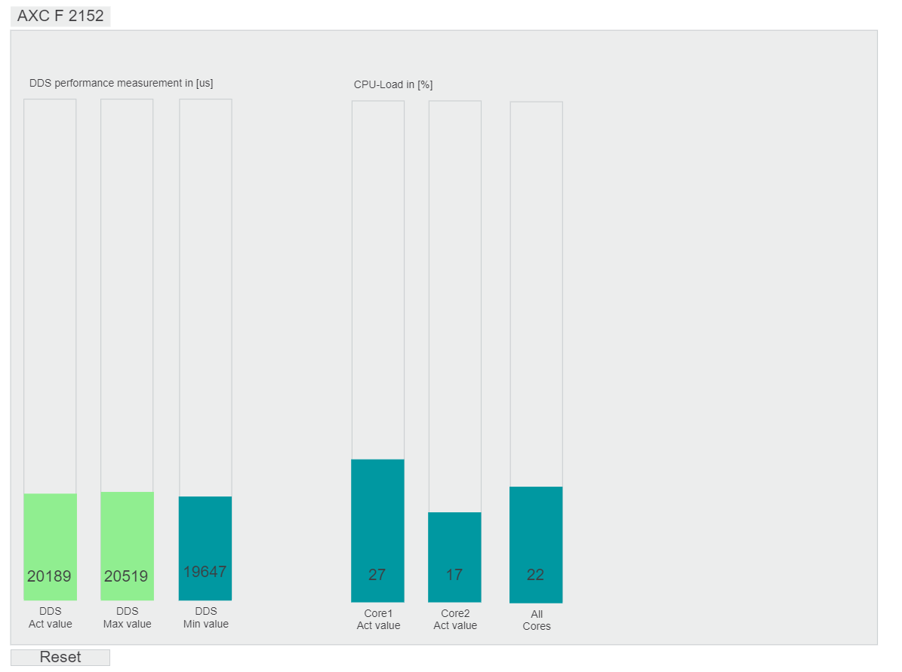
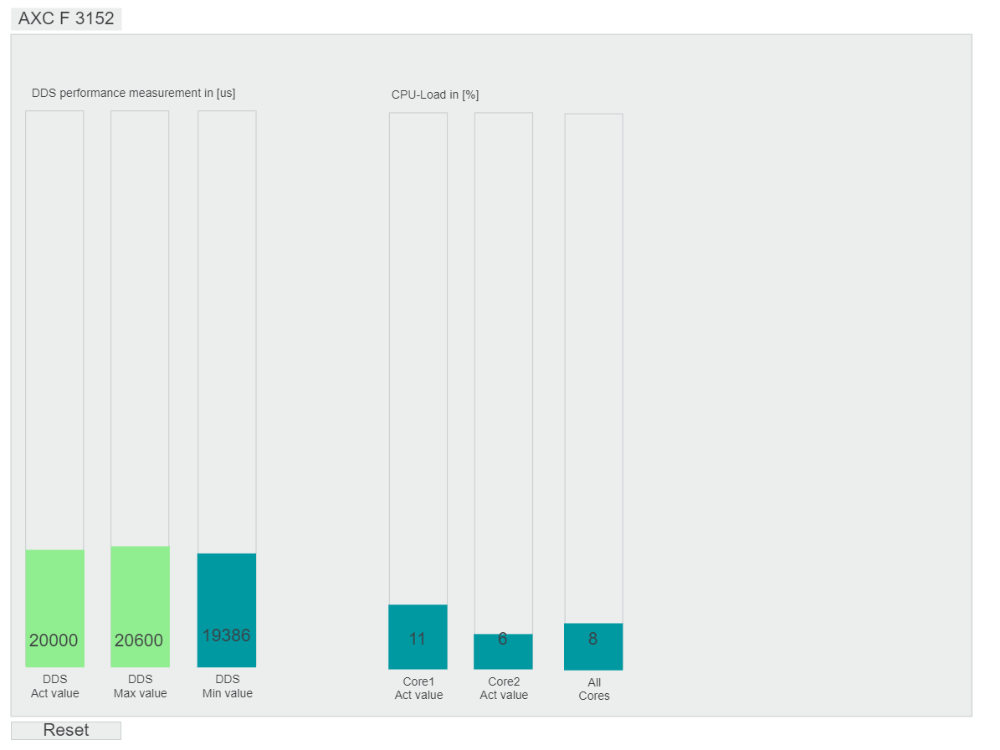

# PLCnext DDS_RoundTrip Sample Application

[](LICENSE)
[](https://www.phoenixcontact.com/plcnext)
[](https://www.plcnext-community.net)


## Introduction

The DDS_RoundTrip example measures the roundtrip duration when sending and receiving the DDS messages between two PLCnext controllers.


## Design

The DDS_RoundTrip example consists of two applications/cotrollers:

AXC F 2152: Sends a message to AXC F 3152 and waits for its return.

AXC F 3152: Waits for messages from AXC F 2152 and sends the same message back.


## Scenario

AXC F 2152 controller sends a message by the “ping” partition(Publisher), which the “ping” partition (Subscriber) on AXC F 3152 controller is waiting for. 
AXC F 3152 controller sends the same message back by the “pong” partition (Publisher), which the “pong” partition (Subscriber) the AXC F 2152 is waiting for. This sequence is repeated cyclically.

The publisher and subscriber partitions contain the configured DDS-Topic “MyTopic” with a maximum length of 2048 bytes. It is used to transfer two variables:
- udiTicksIn (4 Bytes)
- In_Arr_Byte_2044 (2044 Bytes)

**Please Note:**
- Each topic‘s maximum message length is 2048 bytes. If less user data is configured, only the configured amount will be transferred. 
- If the maximum amount of 2048 bytes is exceeded, a notification and log message will be published and the specific Reader or Writer will not start.
- If more than 2048 bytes need to be transferred (number of bytes consumed by the variables), configure additional partitions. A maximum of 64 partitions are allowed. 
- The possible number of partitions is limited by the respective controller performance. You should therefore carry out your own tests to ensure reliable communication before going into productive operation.


## Result

The measurement application running on the AXC F 2152 controller displays the value of the cyclic round trip time in [µs] via eHMI. The application also calculates min/max statistics on cyclic roundtrip measurements.
The AXC F 3152 controller functions as a communication partner. The running application calculates the round trip time between two received DDS-telegrams and displays the mesurements with min/max statistics via eHMI. 


## Dependencies and Configuration

The measured round trip time depends on:

ESM cyclic task configuration and program duration time on AXC F 2152 controller (message sending): Configurable in PLCnEng Project (Tasks -> cycleTime).

ESM cyclic task configuration and program duration time on AXC F 3152 controller (message mirroring, must be twice as fast as the message sender): Configurable in PLCnEng Project (Tasks -> cycleTime).

ESM cyclic task configuration for DDS-App running on AXC F 2152 and AXC F 3152 controllers: Configurable in dds.esm.config file (Tasks -> cycleTime).

Publisher WriteAccess cycle time: Configurable in dds.config file (Publisher -> Writer -> duration).

Subscriber ReadAccess cycle time: Configurable in dds.config file (Subscriber -> Writer -> duration).

Network delay time: depends on network performance.


## Implementation

contains two applications and allows you to measure the cycle time of the DDS roundtrip message and visualize it via eHMI. It can be divided into the following three parts:

1.	The first application running on an AXC F 2152 controller calculates the counter value and writes it to the byte array “Out_Arr_Byte_2044”, additionally it generates a timestamp/ticks_counter which is assigned to the variable “udiTicksOut”. Then the output variables “Out_Arr_Byte_2044” and “udiTicksOut” are published using a “Ping” publisher.

2.	The second application, which runs on an AXC F 3152 controller, subscribes the values from AXC F 2152 controller as a "In_Arr_Byte_2044" and "udiTicksIn" variables using a "Ping" subscriber. The application assigns the array "In_Arr_Byte_2044" to "Out_Arr_Byte_2044" and the variable "udiTicksIn" to the variable "udiTicksOut" and publishes them using a "Pong" publisher.

3.	The first application on the AXC F 2152 controller subscribes the values from AXC F 3152 controller as "In_Arr_Byte_2044" and "udiTicksIn" variables using a "Pong" subscriber and calculates the difference between the current "udiTicksOut" and the received "udiTicksIn" variables/timestamps. The cycle time of the dds message is calculated based on the difference between the two timestamps.


**The following diagram shows the software architecture:**




## Requirements

### Hardware
- Computer with Microsoft Windows operating system
- PLCnext controllers AXC F 2152 (article no.: 2404267) and AXC F 3152 (article no.: 1069208)
- PLCnext Control firmware version 2024.0 LTS or later

### Software

The following software must be installed on the PC:
- WinSCP
- HTML5 capable browser
- PLCnext Engineer version 2024.0.3 LTS or later

### Installation preparation

Please prepare your PLCnext Controls as follows:

**First steps:**
1. Configure the Network Adapter on Microsoft Windows operating system for access to the PLCnext controllers in the range 192.168.1.x/24 (e.g. IP: 192.168.1.100 , Subnet: 255.255.255.0).
2. Set on AXC F 3152 for LAN 1 interface the IP address : `192.168.1.11` as decribed/showed in ["Configuration" > "Network"](https://www.plcnext.help/te/WBM/Configuration_Network.htm). For this, connect AXC F 3152 controller via LAN 1 interface to your PC and enter the following URL in web browser: https://192.168.1.10/wbm
3. Disconnect the AXC F 3152 LAN 1 interface from your PC and connect it to the LAN 1 interface of the AXC F 2152 controller. Then connect the second port of AXC F 2152  LAN 1 interface to your PC.
4. Download the two [PLCnextEngineer demo projects](./PLCnEngProj) for AXC F 2152 and AXC F 3152 controllers from this repository. You can open it with PLCnext Engineer 2024.0.3 LTS.
5. Write and start the demo project to the AXC F 2152 and AXC F 3152.
    - For AXC F 2152, please use: DDS_RoundTrip_AXCF2152.pcwex
    - For AXC F 3152, please use: DDS_RoundTrip_AXCF3152.pcwex

**The following picture shows the hardware architecture:**



**For DDS™ app:**
1. Download the DDS™ app from the PLCnext Store.
    - For AXC F 2152, please download: [DDS™ protocol for ARM](https://www.plcnextstore.com/permalinks/apps/latest/60002172000843)
    - For AXC F 3152, please download: [DDS™ protocol for AXC F 3152](https://www.plcnextstore.com/permalinks/apps/latest/60002172000842)
2. Now open the Web-based Management (WBM).
    - For AXC F 2152, enter the following URL in web browser: https://192.168.1.10/wbm
    - For AXC F 3152, enter the following URL in web browser: https://192.168.1.11/wbm
3. Install the DDS™ app in the WBM section "PLCnext Apps" > "Install app".
4. Start the app after installation and copy the `/opt/plcnext/apps/APP_ID_XXX/example.dds.config` into the directory `/opt/plcnext/appshome/data/APP_ID_XXX` and rename it to `dds.config` as follows:
    - For AXC F 2152, copy and rename the `/opt/plcnext/apps/60002172000843/conf/example.dds.config` to `/opt/plcnext/appshome/data/60002172000843/dds.config`. You can also proceed the steps via secure shell session:
	```bash
	   ssh admin@192.168.1.10
	   cp /opt/plcnext/apps/60002172000843/conf/example.dds.config /opt/plcnext/appshome/data/60002172000843
	   mv /opt/plcnext/appshome/data/60002172000843/example.dds.config /opt/plcnext/appshome/data/60002172000843/dds.config
	```
	
    -  For AXC F 3152, copy and rename the `/opt/plcnext/apps/60002172000842/conf/example.dds.config` to `/opt/plcnext/appshome/data/60002172000842/dds.config`. You can also proceed the steps via secure shell session:
	```bash
	   ssh admin@192.168.1.11
	   cp /opt/plcnext/apps/60002172000842/conf/example.dds.config /opt/plcnext/appshome/data/60002172000842
	   mv /opt/plcnext/appshome/data/60002172000842/example.dds.config /opt/plcnext/appshome/data/60002172000842/dds.config
	```
6. Open the `dds.config` configuration and adapt it. * For the QuickStart you can also use the prepared [dds.config files](./configs) in this repository.

    - For AXC F 2152 add the existing PLCnEng variables/port-connectors and set the "Writer" duration to 10ms and "Reader" duration to 100ms. Then save your changes. The `dds.config` should look like this:
	```xml
	<?xml version="1.0" encoding="utf-8"?>
	<DdsConfigurationDocument
	   schemaVersion="0.1"
	   xmlns:xsi="http://www.w3.org/2001/XMLSchema-instance"
	   xsi:schemaLocation="http://www.phoenixcontact.com/schema/dds.config"
	   xmlns="http://www.phoenixcontact.com/schema/ddsconfig">

	   <Domain id="0">
		  <General>
			 <Interfaces>
				<NetworkInterface>
					<Name>LAN 1</Name>
					<!--Address>192.168.1.10</Address-->
				</NetworkInterface>
			 </Interfaces>
		  </General>
		  <Tracing>
			 <Verbosity>config</Verbosity>
			 <OutputFile>$ARP_PATH_APPS_DATA_DIR$/60002172000843/dds.0.log</OutputFile>
		  </Tracing>
		  <Publisher name="pub0" partitions="ping">
			 <Writer name="wrr0" timestamp="true">
				<Sampling mode="cyclic" duration="10ms"/>
				<Topic name="MyTopic">
				   <!--Variable>Arp.Plc.Eclr/My.Outport.Variable</Variable-->
				   <Variable>Arp.Plc.Eclr/Main_1.udiTicksOut</Variable>
				   <Variable>Arp.Plc.Eclr/Main_1.Out_Arr_Byte_2044</Variable>
				</Topic>
			 </Writer>
		  </Publisher>
		  <Subscriber name="sub0" partitions="pong">
			 <Reader name="rdr0">
				<Substitution mode="lastValues" duration="100ms" />
				<Topic name="MyTopic">
				   <!--Variable>Arp.Plc.Eclr/My.Inport.Variable</Variable -->
				   <Variable>Arp.Plc.Eclr/Main_1.udiTicksIn</Variable>
				   <Variable>Arp.Plc.Eclr/Main_1.In_Arr_Byte_2044</Variable>
				</Topic>
			 </Reader>
		  </Subscriber>
	   </Domain>

	</DdsConfigurationDocument>
	```
	
    - For AXC F 3152 add the existing PLCnEng variables/port-connectors, set the "Writer" duration to 10ms and "Reader" duration to 100ms and adapt/replace the Publisher partition name "ping" with "pong" and Subscriber partition name "pong" with "ping". Then save your changes. The `dds.config` should look like this:
	```xml
	<?xml version="1.0" encoding="utf-8"?>
	<DdsConfigurationDocument
	   schemaVersion="0.1"
	   xmlns:xsi="http://www.w3.org/2001/XMLSchema-instance"
	   xsi:schemaLocation="http://www.phoenixcontact.com/schema/dds.config"
	   xmlns="http://www.phoenixcontact.com/schema/ddsconfig">

	   <Domain id="0">
		  <General>
			 <Interfaces>
				<NetworkInterface>
					<Name>LAN 1</Name>
					<!--Address>192.168.1.10</Address-->
				</NetworkInterface>
			 </Interfaces>
		  </General>
		  <Tracing>
			 <Verbosity>config</Verbosity>
			 <OutputFile>$ARP_PATH_APPS_DATA_DIR$/60002172000842/dds.0.log</OutputFile>
		  </Tracing>
		  <Publisher name="pub0" partitions="pong">
			 <Writer name="wrr0" timestamp="true">
				<Sampling mode="cyclic" duration="10ms"/>
				<Topic name="MyTopic">
				   <!--Variable>Arp.Plc.Eclr/My.Outport.Variable</Variable-->
				   <Variable>Arp.Plc.Eclr/Main_1.udiTicksOut</Variable>
				   <Variable>Arp.Plc.Eclr/Main_1.Out_Arr_Byte_2044</Variable>
				</Topic>
			 </Writer>
		  </Publisher>
		  <Subscriber name="sub0" partitions="ping">
			 <Reader name="rdr0">
				<Substitution mode="lastValues" duration="100ms" />
				<Topic name="MyTopic">
				   <!--Variable>Arp.Plc.Eclr/My.Inport.Variable</Variable -->
				   <Variable>Arp.Plc.Eclr/Main_1.udiTicksIn</Variable>
				   <Variable>Arp.Plc.Eclr/Main_1.In_Arr_Byte_2044</Variable>
				</Topic>
			 </Reader>
		  </Subscriber>
	   </Domain>

	</DdsConfigurationDocument>
	```

7. To reduce the CPU Load on the AXC F 2152 controller, increase the "cycleTime" of "App.Dds.Task" from 1000000ns to 5000000ns:

	- Open the `/opt/plcnext/appshome/data/60002172000843/dds.esm.config` and configure the "cycleTime" to 5000000.
	- Save the file `dds.esm.config` and accept the “permissions” error (the file is saved despite the “permissions” error, this is a know behavior)
   
8. Restart the both PLCs, e.g. by switching off and switching on the power supply or restart the plcnext process via following command line:

   ```bash
   sudo /etc/init.d/plcnext restart
   ```
   
9. Give the plcnext process a short time to start the application, after this, the project installation is finished and you can access and use the visualization in the web browser:

    - For AXC F 2152, the eHMI-Site can be access within a web browser using the URL: https://192.168.1.10/ehmi/hmiapp.html
    - For AXC F 3152, the eHMI-Site can be access within a web browser using the URL: https://192.168.1.11/ehmi/hmiapp.html

10. At the eHMI page press the „Reset“ button and monitor the round trip time of the DDS data transmission between two PLCnext controllers:

	



	



## Contributing

You can participate in this project by submitting bugs and feature requests.
Please let us know if anything is not working out as expected.

## Feedback

* Ask a question in our [Forum](https://www.plcnext-community.net/index.php?option=com_easydiscuss&view=categories&Itemid=221&lang=en).
* Request a new feature on [GitHub](CONTRIBUTING.md).

## License

Copyright (c) Phoenix Contact Gmbh & Co KG. All rights reserved.


----
