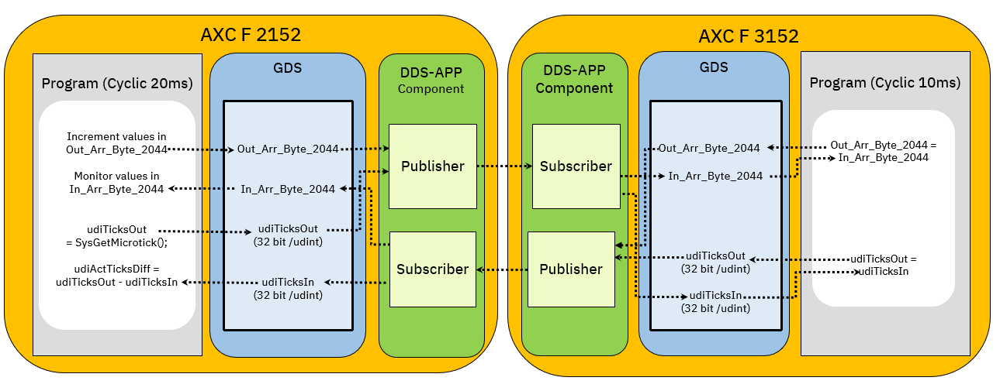

# PLCnext DDS_RoundTrip Sample Application

[](LICENSE)
[](https://www.phoenixcontact.com/plcnext)
[](https://www.plcnext-community.net)


## Introduction

The DDS_RoundTrip sample contains two application and allows you to measure the cycle time of the DDS roundtrip message on two PLCnext controllers and visualize it via eHMI. It can be divided into the following three parts:

1.	The first application runs on an AXC F 2152 controller and generates a timestamp/ticks_counter that is assigned to the variable "udiTicksOut" and published using a "Ping" publisher.

2.	The second application, which runs on an AXC F 3152 controller, subscribes to this as a "udiTicksIn" variable using a "Ping" subscriber. The application assigns the variable "udiTicksIn" to the variable "udiTicksOut" and publishes it using a "Pong" publisher.

3.	The first application on the AXC F 2152 controller subscribes to this variable as "udiTicksIn" using a "Pong" subscriber and calculates the difference between the current "udiTicksOut" and the received "udiTicksIn" variables/timestamps. The cycle time of the dds message is calculated based on the difference between the two timestamps.


**The following diagram shows the software architecture:**




## Requirements

### Hardware
- Computer with Microsoft Windows operating system
- PLCnext controllers AXC F 2152 (article no.: 2404267) and AXC F 3152 (article no.: 1069208)
- PLCnext Control firmware version 2024.0 LTS or later

### Software

The following software must be installed on the PC:
- WinSCP
- HTML5 capable browser
- PLCnext Engineer version 2024.0.2 LTS or later

### Installation preparation

Please prepare your PLCnext Controls as follows:

**First steps:**
1. Reset your PLC's. For this, push the reset button during the boot process until RUN and FAIL LED light up. </br> DO NOT PRESS THE RESET BUTTON FOR MORE THAN 20 SECONDS.
2. Set on AXC F 3152 for LAN 1 interface the IP address : `192.168.1.11` in ["Configuration" > "Network"](https://www.plcnext.help/te/WBM/Configuration_Network.htm). For this, connect AXC F 3152 controller via LAN 2 interface to your PC and enter the following URL in web browser: https://192.168.2.10/wbm
3. Download the [PLCnextEngineer demo projects](./PLCnEngProj) from this repository. You can open it with PLCnext Engineer 2024.0.2 LTS.
4. Write and start the demo project to the AXC F 2152 and AXC F 3152.
    - For AXC F 2152, please use: DDS_RoundTrip_AXCF2152.pcwex
    - For AXC F 3152, please use: DDS_RoundTrip_AXCF3152.pcwex
5. Connect the LAN 1 interface of AXC F 3152 controller to AXC F 2152 via ethernet cable.

**The following picture shows the hardware architecture:**


**For DDS™ app:**
1. Download the DDS™ app from the PLCnext Store.
    - For AXC F 2152, please download: [DDS™ protocol for ARM](https://www.plcnextstore.com/permalinks/apps/latest/60002172000843)
    - For AXC F 3152, please download: [DDS™ protocol for AXC F 3152](https://www.plcnextstore.com/permalinks/apps/latest/60002172000842)
2. Now open the Web-based Management (WBM).
    - For AXC F 2152, enter the following URL in web browser: https://192.168.1.10/wbm
    - For AXC F 3152, enter the following URL in web browser: https://192.168.1.11/wbm
3. Install the DDS™ app in the WBM section "PLCnext Apps" > "Install app".
4. Start the app after installation and copy the `/opt/plcnext/apps/APP_ID_XXX/example.dds.config` into the directory `/opt/plcnext/appshome/data/APP_ID_XXX` and rename it to `dds.config` as follows:
    - For AXC F 2152, copy and rename the `/opt/plcnext/apps/60002172000843/conf/example.dds.config` to `/opt/plcnext/appshome/data/60002172000843/dds.config`. You can also proceed the steps via secure shell session:
	```bash
	   ssh admin@192.168.1.10
	   cp /opt/plcnext/apps/60002172000843/conf/example.dds.config /opt/plcnext/appshome/data/60002172000843
	   mv /opt/plcnext/appshome/data/60002172000843/example.dds.config /opt/plcnext/appshome/data/60002172000843/dds.config
	```
	
    -  For AXC F 3152, copy and rename the `/opt/plcnext/apps/60002172000842/conf/example.dds.config` to `/opt/plcnext/appshome/data/60002172000842/dds.config`. You can also proceed the steps via secure shell session:
	```bash
	   ssh admin@192.168.1.11
	   cp /opt/plcnext/apps/60002172000842/conf/example.dds.config /opt/plcnext/appshome/data/60002172000842
	   mv /opt/plcnext/appshome/data/60002172000842/example.dds.config /opt/plcnext/appshome/data/60002172000842/dds.config
	```
6. Open the `dds.config` configuration and adapt it. * For the QuickStart you can also use the prepared [dds.config files](./configs) in this repository.

    - For AXC F 2152 add the existing PLCnEng variables/port-connectors and set the "Writer" duration to 10ms and "Reader" duration to 100ms. Then save your changes. The `dds.config` should look like this:
	```xml
	<?xml version="1.0" encoding="utf-8"?>
	<DdsConfigurationDocument
	   schemaVersion="0.1"
	   xmlns:xsi="http://www.w3.org/2001/XMLSchema-instance"
	   xsi:schemaLocation="http://www.phoenixcontact.com/schema/dds.config"
	   xmlns="http://www.phoenixcontact.com/schema/ddsconfig">

	   <Domain id="0">
		  <General>
			 <Interfaces>
				<NetworkInterface>
					<Name>LAN 1</Name>
					<!--Address>192.168.1.10</Address-->
				</NetworkInterface>
			 </Interfaces>
		  </General>
		  <Tracing>
			 <Verbosity>config</Verbosity>
			 <OutputFile>$ARP_PATH_APPS_DATA_DIR$/60002172000843/dds.0.log</OutputFile>
		  </Tracing>
		  <Publisher name="pub0" partitions="ping">
			 <Writer name="wrr0" timestamp="true">
				<Sampling mode="cyclic" duration="10ms"/>
				<Topic name="MyTopic">
				   <!--Variable>Arp.Plc.Eclr/My.Outport.Variable</Variable-->
				   <Variable>Arp.Plc.Eclr/Main_1.udiTicksOut</Variable>
				   <Variable>Arp.Plc.Eclr/Main_1.Out_Arr_Byte_2044</Variable>
				</Topic>
			 </Writer>
		  </Publisher>
		  <Subscriber name="sub0" partitions="pong">
			 <Reader name="rdr0">
				<Substitution mode="lastValues" duration="100ms" />
				<Topic name="MyTopic">
				   <!--Variable>Arp.Plc.Eclr/My.Inport.Variable</Variable -->
				   <Variable>Arp.Plc.Eclr/Main_1.udiTicksIn</Variable>
				   <Variable>Arp.Plc.Eclr/Main_1.In_Arr_Byte_2044</Variable>
				</Topic>
			 </Reader>
		  </Subscriber>
	   </Domain>

	</DdsConfigurationDocument>
	```
	
    - For AXC F 3152 add the existing PLCnEng variables/port-connectors, set the "Writer" duration to 10ms and "Reader" duration to 100ms and adapt/replace the Publisher partition name "ping" with "pong" and Subscriber partition name "pong" with "ping". Then save your changes. The `dds.config` should look like this:
	```xml
	<?xml version="1.0" encoding="utf-8"?>
	<DdsConfigurationDocument
	   schemaVersion="0.1"
	   xmlns:xsi="http://www.w3.org/2001/XMLSchema-instance"
	   xsi:schemaLocation="http://www.phoenixcontact.com/schema/dds.config"
	   xmlns="http://www.phoenixcontact.com/schema/ddsconfig">

	   <Domain id="0">
		  <General>
			 <Interfaces>
				<NetworkInterface>
					<Name>LAN 1</Name>
					<!--Address>192.168.1.10</Address-->
				</NetworkInterface>
			 </Interfaces>
		  </General>
		  <Tracing>
			 <Verbosity>config</Verbosity>
			 <OutputFile>$ARP_PATH_APPS_DATA_DIR$/60002172000842/dds.0.log</OutputFile>
		  </Tracing>
		  <Publisher name="pub0" partitions="pong">
			 <Writer name="wrr0" timestamp="true">
				<Sampling mode="cyclic" duration="10ms"/>
				<Topic name="MyTopic">
				   <!--Variable>Arp.Plc.Eclr/My.Outport.Variable</Variable-->
				   <Variable>Arp.Plc.Eclr/Main_1.udiTicksOut</Variable>
				   <Variable>Arp.Plc.Eclr/Main_1.Out_Arr_Byte_2044</Variable>
				</Topic>
			 </Writer>
		  </Publisher>
		  <Subscriber name="sub0" partitions="ping">
			 <Reader name="rdr0">
				<Substitution mode="lastValues" duration="100ms" />
				<Topic name="MyTopic">
				   <!--Variable>Arp.Plc.Eclr/My.Inport.Variable</Variable -->
				   <Variable>Arp.Plc.Eclr/Main_1.udiTicksIn</Variable>
				   <Variable>Arp.Plc.Eclr/Main_1.In_Arr_Byte_2044</Variable>
				</Topic>
			 </Reader>
		  </Subscriber>
	   </Domain>

	</DdsConfigurationDocument>
	```
	
7. Restart the both PLCs, e.g. by switching off and switching on the power supply or restart the plcnext process via following command line:

   ```bash
   sudo /etc/init.d/plcnext restart
   ```
   
8. Give the plcnext process a short time to start the application, after this, the project installation is finished and you can access and use the visualization in the web browser:

    - For AXC F 2152, the eHMI-Site can be access within a web browser using the URL: https://192.168.1.10/ehmi/hmiapp.html
    - For AXC F 3152, the eHMI-Site can be access within a web browser using the URL: https://192.168.1.11/ehmi/hmiapp.html

9. Press the "Reset" button and monitor the round trip time of the DDS data transmission between two PLCnext controllers:

	


	


## Contributing

You can participate in this project by submitting bugs and feature requests.
Please let us know if anything is not working out as expected.

## Feedback

* Ask a question in our [Forum](https://www.plcnext-community.net/index.php?option=com_easydiscuss&view=categories&Itemid=221&lang=en).
* Request a new feature on [GitHub](CONTRIBUTING.md).

## License

Copyright (c) Phoenix Contact Gmbh & Co KG. All rights reserved.


----
